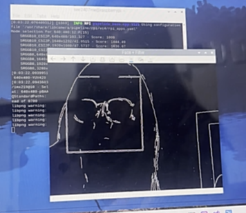

# 라즈베리파이 OpenCV 얼굴 인식 프로젝트 실습 과제 3

## 1. 서론

이 프로젝트는 라즈베리파이(Raspberry Pi)와 OpenCV를 활용하여 **실시간 얼굴 인식을 구현**하는 것을 목표로 한다.  
또한, 영상 필터 적용, 중복 저장 방지, 파일 정리 등 다양한 기능 확장도 시도하였다.

---

## 2. 실습 과정 및 코드

### (1) 라즈베리파이 세팅

- Raspberry Pi OS 1.9.4 설치 #sd 카드 굽고 라즈베리와 연결
- SSH 원격 접속 설정 #putty를 이용해 접속 (원격으로 아이피 알기)
- `sudo apt update && sudo apt upgrade`로 최신화

### (2) OpenCV 설치

```bash
sudo apt install python3-opencv -y
```

- 설치 후 `cv2.__version__`으로 정상 설치 확인

### (3) 카메라 설정 확인

- 최신 OS에서는 `libcamera`가 기본
- `libcamera-hello`, `libcamera-vid` 명령어로 카메라 작동 테스트

### (4) 얼굴 인식 기능 구현

```python
face_cascade = cv2.CascadeClassifier(
    cv2.data.haarcascades + 'haarcascade_frontalface_default.xml'
) # 오류발생
```

- 오류로 인해 직접 다운로드해서 사용:

```bash
wget https://github.com/opencv/opencv/raw/master/data/haarcascades/haarcascade_frontalface_default.xml
```

```python
face_cascade = cv2.CascadeClassifier("haarcascade_frontalface_default.xml")
```

### (5) 실시간 필터 적용 기능

- 키보드 입력에 따라 영상 필터 전환:
  - `g`: 그레이스케일
  - `e`: 엣지 감지
  - `s`: 세피아
  - `n`: 원본 유지

---

## 3. 전체 코드 요약 (얼굴 인식 + 필터 적용)

```python
import subprocess
import cv2
import numpy as np

face_cascade = cv2.CascadeClassifier("haarcascade_frontalface_default.xml")
FILTER = 'none'

ffmpeg_cmd = [
    "libcamera-vid",
    "--nopreview", "true",
    "-t", "0",
    "--codec", "mjpeg",
    "-o", "-",
    "--width", "640",
    "--height", "480",
    "--framerate", "15"
]

process = subprocess.Popen(ffmpeg_cmd, stdout=subprocess.PIPE)
buffer = b""

while True:
    chunk = process.stdout.read(1024)
    if not chunk:
        break
    buffer += chunk
    start = buffer.find(b'\xff\xd8')
    end = buffer.find(b'\xff\xd9')
    if start != -1 and end != -1:
        jpg = buffer[start:end + 2]
        buffer = buffer[end + 2:]
        img_array = np.frombuffer(jpg, dtype=np.uint8)
        frame = cv2.imdecode(img_array, cv2.IMREAD_COLOR)

        if frame is not None:
            gray = cv2.cvtColor(frame, cv2.COLOR_BGR2GRAY)
            faces = face_cascade.detectMultiScale(gray, scaleFactor=1.1, minNeighbors=5)
            for (x, y, w, h) in faces:
                cv2.rectangle(frame, (x, y), (x + w, y + h), (0, 255, 0), 2)

            if FILTER == 'gray':
                output = cv2.cvtColor(frame, cv2.COLOR_BGR2GRAY)
            elif FILTER == 'edge':
                output = cv2.Canny(gray, 100, 200)
            elif FILTER == 'sepia':
                kernel = np.array([
                    [0.272, 0.534, 0.131],
                    [0.349, 0.686, 0.168],
                    [0.393, 0.769, 0.189]
                ])
                output = cv2.transform(frame, kernel)
                output = np.clip(output, 0, 255).astype(np.uint8)
            else:
                output = frame

            cv2.imshow("Face + Filter", output)
            key = cv2.waitKey(1) & 0xFF
            if key == ord('q'):
                break
            elif key == ord('g'):
                FILTER = 'gray'
            elif key == ord('e'):
                FILTER = 'edge'
            elif key == ord('s'):
                FILTER = 'sepia'
            elif key == ord('n'):
                FILTER = 'none'

process.terminate()
cv2.destroyAllWindows()
```

---

## 4. 실습 결과 요약

- MJPEG 스트림으로 실시간 얼굴 인식 성공
- 키보드 입력으로 필터 즉시 적용됨
- haarcascade로 얼굴 인식 후 bounding box 표시 완료

---
## 실습 결과 사진


